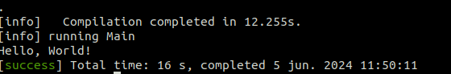

# 1-Intro

1. [Intro](#schema1)
2. [Diferencias básicas con Java](#schema2)
3. [Ejemplo. Crear un proyecto](#schema3)
4. [REF](#schemaref)

<hr>

<a name="schema1"></a>

## 1. Intro


### **sbt (Scala Build Tool)**
`sbt` es la herramienta de construcción recomendada para Scala, similar a Maven o Gradle para Java.
### **coursier**
`coursier`, una herramienta moderna y poderosa para gestionar dependencias y distribuciones en el ecosistema de Scala. `coursier` puede simplificar la instalación y actualización de Scala, sbt, y otras herramientas.


<hr>

<a name="schema2"></a>

## 2. Diferencias básicas con Java


<hr>

<a name="schema3"></a>

## 3. Ejemplo. Crear un proyecto 

1. En Visual Studio Code instalar la extencion Metals.
2. Ejecuta el siguiente comando para iniciar un nuevo proyecto con sbt en la carpeta deseada:

```bash
sbt new scala/hello-world.g8
```
  - Esto creará un proyecto Scala básico con una sola clase que imprime "Hello, World!".

  - Cuando aparezca esto, `name [Hello World template]:` poner el nombre del proyecto en este caso `hello_world`

  - Espera a que sbt descargue las dependencias y genere la estructura del proyecto.
  - Ejecuta el siguiente comando para iniciar un nuevo proyecto con sbt:

```bash
sbt new scala/scala-seed.g8
```
  - Este comando utiliza la plantilla `scala-seed.g8`, que crea un proyecto Scala simple y vacío sin ninguna clase o código predefinido.
```
my-scala-project/
  ├── build.sbt
  ├── project/
  │   └── build.properties
  └── src/
      └── main/
          └── scala/
              └── YourPackageName/
                  └── Main.scala
```


3.  Para ejecutar el código, simplemente abre una terminal, vavega en la terminal hasta la caperte `src/main` y ejecuta
```sbt
sbt run
```




<hr>

<a name="schemaref"></a>


## REF: 
https://www.udemy.com/course/scala-desde-cero/

Doc: https://scala-lang.org/

Install: https://docs.scala-lang.org/getting-started/index.html