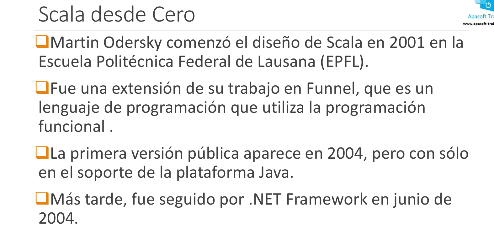
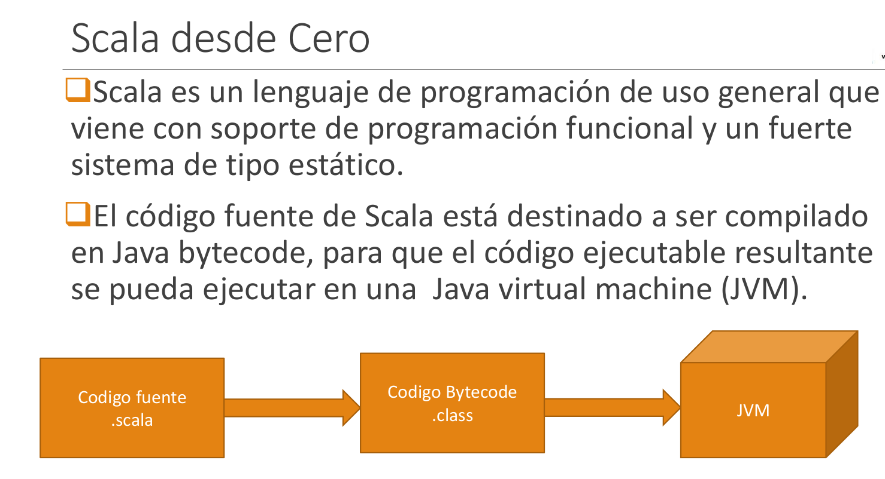
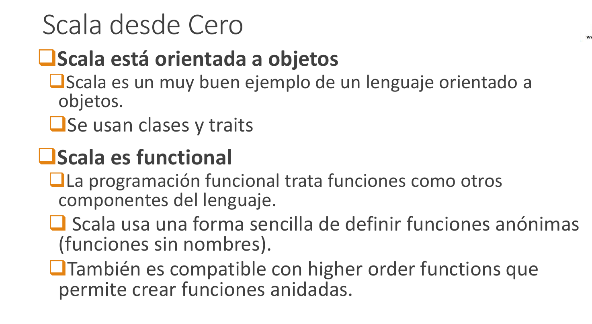
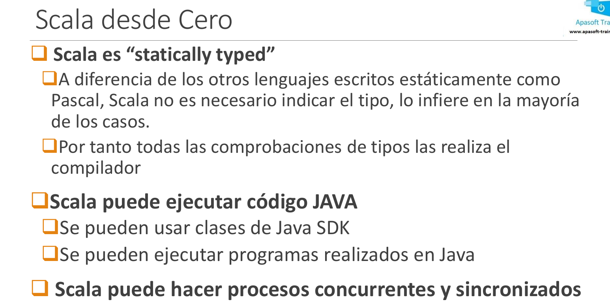
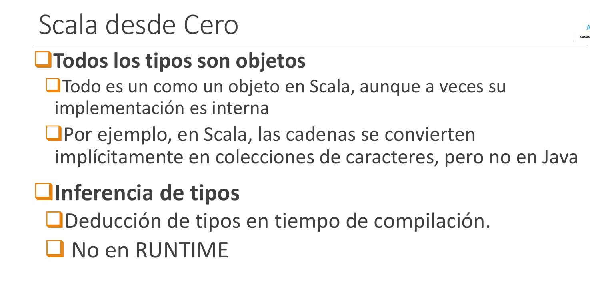
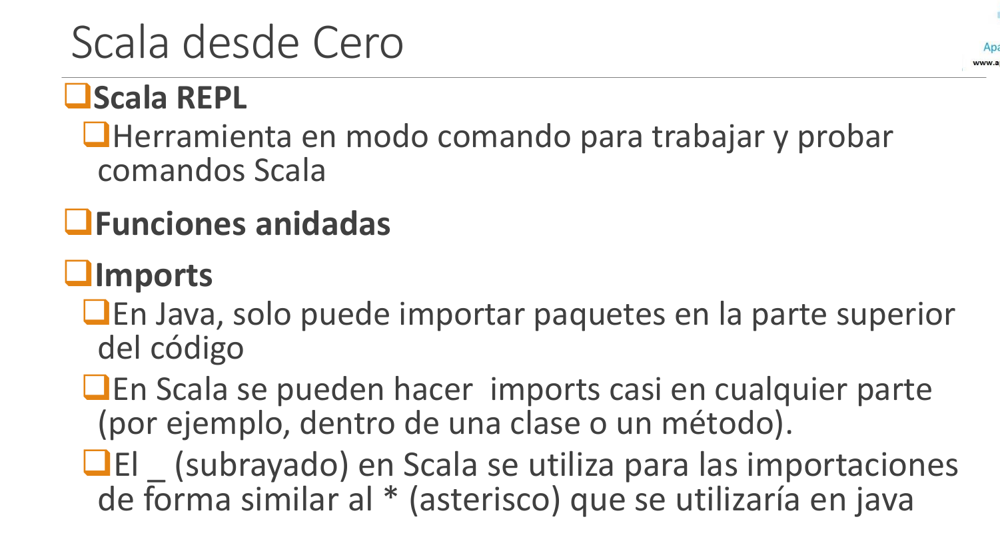

# 1-Intro

1. [Intro](#schema1)
2. [Diferencias básicas con Java](#schema2)

10. [REF](#schemaref)

## 1. Intro

## 2. Diferencias básicas con Java

## REF: 
https://www.udemy.com/course/scala-desde-cero/